# Kaminari  
Federal University of Itajubá – UNIFEI

### Build Report – Kaminari

Eric Makiya Lazanha and Marcos André M. S. Filho

Last reviewer: Eric Makiya Lazanha

Itajubá

2023

## Resume

Kaminari is a redesigned control board developed for mini-sumo robots, transitioning from an Arduino-based system to an STM32F405RGT microcontroller. This redesign was driven by the need for more compact and modular boards for the category.

In addition to being more compact, the board is highly flexible, as the control board is separated from the motor drivers and connected via flat cables. This modular design allows for different driver models to be used, enabling the team to redesign either the control board or the drivers independently, depending on the need.

The board also supports 4S batteries (16.8V), which was not possible with the previously used power board based on the TB6612FNGC8EL.

The design was inspired by the PlayStation Vita (PSVita), which features a main board and two secondary boards arranged horizontally and interconnected by flexible cables.

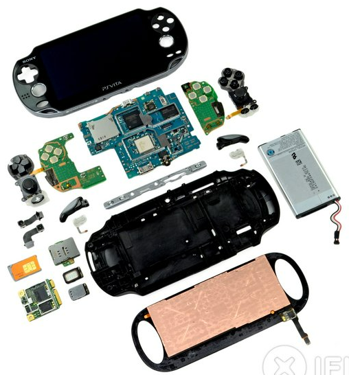

Figure 1 – Internal layout of a disassembled PSVita, showing the separation between the mainboard and secondary boards.

[1. Schematic](#schematic)

[1.1 Control Board](#control-board)

[1.1.1 5V Regulator](#5v-regulator)  
[1.1.2 3.3V Regulator](#33v-regulator)  
[1.1.3 Logic Circuit](#logic-circuit)  
[1.1.4 Peripherals](#peripherals)  
[1.1.5 Bluetooth](#bluetooth)  
[1.1.6 Microstarter](#microstarter)  
[1.1.7 Strategy Switch](#strategy-switch)  
[1.1.8 Secondary Power Supply](#secondary-power-supply)  
[1.1.9 Battery Meter](#battery-meter)  
[1.1.10 Debug LED](#debug-led)  
[1.1.11 Infrared Sensor](#infrared-sensor)  
[1.1.12 Flag](#flag)  
[1.1.13 Driver Connector](#driver-connector)  
[1.1.14 Driver](#driver)  
[1.1.15 Left DRV8871](#left-drv8871)  
[1.1.16 L9958SBTR](#l9958sbtr)

[2. Layouts](#layouts)

[2.1 Control Board Layout](#control-board-layout)  
[2.1.1 5V Power Supply Layout with Switch](#5v-power-supply-layout-with-switch)  
[2.1.2 3.3V Power Supply Layout](#33v-power-supply-layout)

[2.2 Auxiliary Boards Layout](#auxiliary-boards-layout)  
[2.2.1 Infrared Sensors Layout](#infrared-sensors-layout)  
[2.2.2 Microstarter Layout](#microstarter-layout)  
[2.2.3 Flag Servo Layout](#flag-servo-layout)  
[2.2.4 STM Loader Layout](#stm-loader-layout)  
[2.2.5 Strategy Switch Layout](#strategy-switch-layout)  
[2.2.6 Debug LEDs and Bluetooth Layout](#debug-leds-and-bluetooth-layout)  
[2.2.7 Control Board Layout Summary](#control-board-layout-summary)

[2.3 Driver Layouts](#driver-layouts)  
[2.3.1 DRV8871 Driver Layout](#drv8871-driver-layout)  
[2.3.2 L9958SBTR Layout](#l9958sbtr-layout)

[3. Conclusion](#conclusion)

# Schematic

## Control Board

### 5V Regulator

To step down the voltage from 12.6V (3S battery voltage) to 5V, a linear power supply was used with two voltage regulators (L7805CD2T-TR) connected in parallel, in order to prevent overheating issues and improve heat dissipation.

Figure 2 – 5V Linear Regulator

In addition to the voltage regulators, there is also a switch (JS202011SCQN) and a MOSFET (FDS6576) that allow the board to be powered off without disconnecting the battery. The MOSFET also serves as reverse polarity protection. A debug LED is also included in the circuit.

### 3.3V Regulator

Figure 3 – 3.3V Linear Regulator

To step down from 5V to 3.3V, a linear regulator (LDL1117S33R) was used. The design was inspired by the 3.3V regulator from the Raijin board, which had already been validated.

### Logic Circuit

Figure 4 – Microcontroller Schematic

The choice of this microcontroller was crucial for the overall development of the autonomous robots. In our category — line follower — we selected the same microcontroller, but in a 64-pin package, which increases code compatibility and facilitates collaboration between both categories. The line follower robots require more components than mini sumo robots, making this choice even more appropriate.

The decision to use an ST microcontroller was made jointly with members of the line follower team, aiming to foster greater interaction within the autonomous category. This also allowed us to standardize key aspects of the robots, such as motors and sensors, thus promoting mutual development between the categories.

To program this microcontroller, a header bus is used, which is then connected to an ST-Link that allows it to interface with a computer's USB port.

Figure 5 – STM Bootloader

Figure 6 - STlink

### Peripherals 

Finally, after the schematics, we move on to the boards that support the decisions the robot needs to make.

For 3-pin buses, a protection method we adopted—and strongly recommend for all projects—is to place GND on the middle pin.

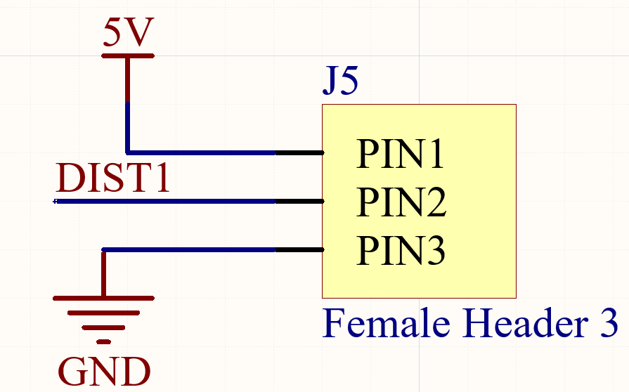

Figure 7 – Before Applying the Protection Method

Figure 8 – After Applying the Protection Method

Why make this change?

Imagine you're one week away from a competition — it's practically pre-war. You're juggling university life at UNIFEI and your responsibilities as a member of the UAI!RRIOR team. In a moment of fatigue, with the old pinout model, you could accidentally short GND and VCC, burning out components and needing to solder a new board (in the best-case scenario where you even have spare components).

However, if you place GND in the middle, the worst that can happen is swapping the signal and VCC pins. In this case, your only concern will be correcting their positions — a much safer and more forgiving setup.

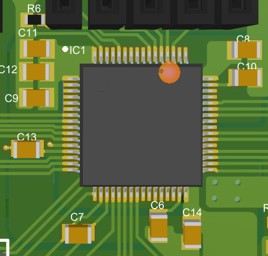

Figure 9 – Boot Resistor and Decoupling Capacitors

### Bluetooth

Figura 10 Bluetooth

Making strategy adjustments easier and more professional through the use of a mobile app was also implemented in the follow line category. This eliminates the need for computers when taking the sumo robots for timing or making adjustments to the follow line on the track.

### *Microstarter*

Figure 11 – Micro Starter

The microstarter is an off-the-shelf board whose function is to receive an infrared signal and decode it, sending this information to the microcontroller. Its purpose is to receive the signal sent by the referee’s remote control to make decisions such as start, stop, or parity (which is used to verify if the robot is indeed receiving a signal).

###  *Strategy Switch*

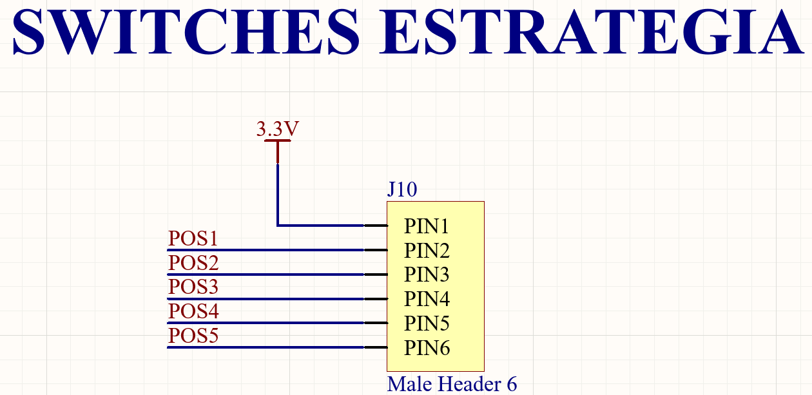

Figure 12 – Strategy Switches
 
If there is any problem with Bluetooth, strategy switches can be used to manually select the strategy via a separate board that fits onto the control board (circled in red in the image below).

Figure 13 – Strategy Switch on the Control Board

This board has the capacity to select up to 32 strategies using 5 switches that operate based on the concept of binary numbers, where each switch position determines whether it represents a 0 or a 1.

Figure 14 – Switches Board

Figure 15 – Decimal to Binary Conversion

Figure 16 – Strategy Switches Schematic

A very simple board that can be connected via headers to the control board.

### Secondary Power Supply

Figure 17 - Secondary Power Supply

It is used to power the control board directly, without the need to connect the drivers. It does not need to be powered with 5V, as the voltage will still pass through the onboard voltage regulators.

### Battery Meter

Figure 18 – Battery Meter

A voltage divider is used to measure the battery voltage that goes into an ADC input.

Example for a 3S battery (12.6 V):

- The current will be 12.6 V / 13.3 kΩ = 0.95 mA.

- The voltage across the resistor connected to the microcontroller will be 3.3 kΩ × 0.95 mA = 3.13 V.

- With the battery voltage at 11.4 V, for example, the current will be 11.4 V / 13.3 kΩ = 0.86 mA.

- The voltage across the resistor will then be 3.3 kΩ × 0.86 mA = 2.84 V.

We can use 3.13 V as 255 and 0 V as 0 through programming. Thus, from a certain threshold, the LEDs can be programmed to signal that the battery needs to be replaced.

It is important to note that the ADC (Analog-to-Digital Converter) input supports only up to 3.3 V according to the datasheet, which is why the voltage had to be reduced. The capacitor serves only to keep the signal stable (decoupling capacitor).

Figure 19 – Microcontroller Maximum Input Voltage Datasheet

It is also possible to use a 4S battery (16.8 V), but it is necessary to replace the 3.3 kΩ resistor with a 2.2 kΩ resistor to ensure the input voltage to the microcontroller stays below 3.3 V. The battery voltage calculation in the program would also need to be adjusted accordingly.

### Debug LED

Figure 20 – Debug LED

To facilitate use and coding, four debug LEDs were added to help the programmer troubleshoot potential code errors.

### Infrared Sensor

Figure 21 – Infrared Sensors

It supports up to 7 sensors, with 5 digital and 2 analog inputs. It is extremely important that the JS40F and EM3 sensors are powered with 5V so they can operate at their full specified detection range as provided by the manufacturer.

A voltage divider was necessary to reduce the ADC input voltage from 5V to 3.3V because the microcontroller’s ADC input can handle a maximum of 3.3V, just as was explained earlier in the battery meter section. However, the sensor power supply does not come directly from the battery; it passes through a voltage regulator that provides a stable 5V output.

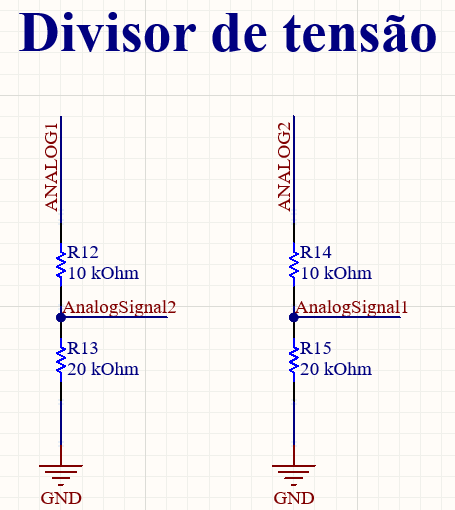

Figure 22 – Analog Sensor Voltage Divider

### Flag

Figure 23 – Flag Servo
 
The servo is specific for robots that use a flag, whose purpose is to “trick” the opponent’s sensor.

### Driver Connector

Figure 24 – Driver Schematic

There was a replacement of the headers previously used in earlier projects with connectors due to poor contact issues, as the headers would often come loose.

It is very important to be careful when designing the driver schematics—the right side should be mirrored to properly fit onto the board. This way, the driver design becomes somewhat separate, allowing for the creation of various drivers that can be connected to the control board via two connectors (505278-1033) and two flat cables. These should be positioned as illustrated in the image below:

Figure 25 – Flat Cable Connector

### Driver

Two different driver models (DRV8871 and L9958SBTR) were designed to be used with this board. This choice was made so that if there is any issue with one of the drivers, it would still be possible to validate the board—assuming the problem isn’t with the control board. Moreover, this approach provides the team with great flexibility in their component choices.

### 

### Left DRV8871

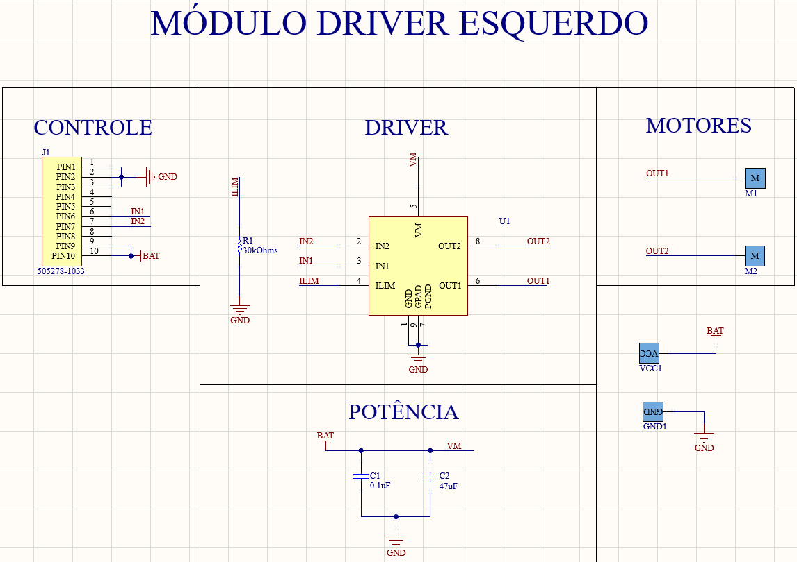

Figure 26 – DRV8871 Schematic

This driver was recommended by Trincabotz and was already available in the lab due to its use in the follow line category. It is worth noting that the schematics are the same, with only the control section differing.

The driver worked as expected.

Figure 27 – Left DRV8871 Connector

Figure 28 – Right DRV8871 Connector

The connectors are mirrored to match the fitting on the control board.

### L9958SBTR

Figure 29 – L9958SBTR Schematic

This driver was chosen because it had already been used in other team projects and was available in the lab.

At first, the board didn’t work correctly, so we shorted the resistors circled below, and then it worked perfectly. However, this malfunction could also have been caused by a programming issue.

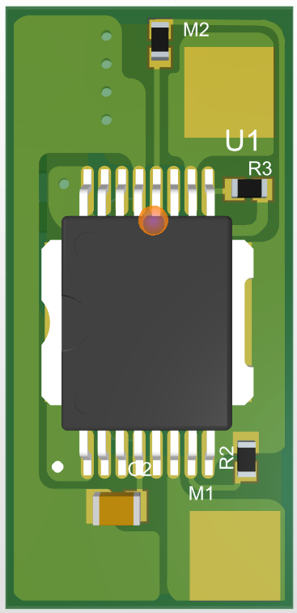

Figure 30 – 3D Model of Right L9958SBTR

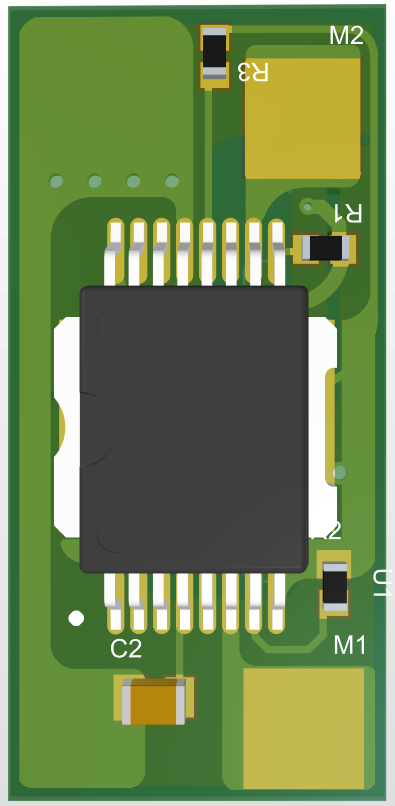

Figura 31 3D L9958SBTR esquerdo

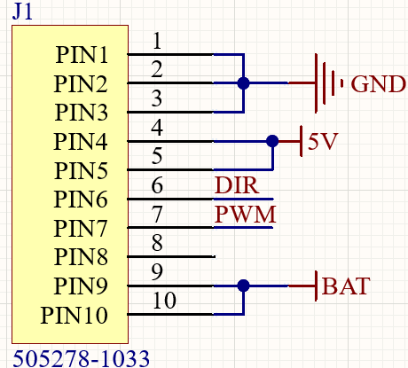

Figure 31 – 3D Model of Left L9958SBTR

Figure 33 – Right L9958SBTR Connector

> The connectors are mirrored to match the fitting on the control board.

# *Layouts*

A PCB layout is simply the final design showing how the traces and component placements will be arranged, as well as defining the board’s physical size.

Figure 35 – Kaminari PCB Example

## Control Board Layout

### 5V Power Supply Layout with Switch

Figure 35 – 3D View of 5V Linear Power Switch

Figure 36 – 5V Linear Power Switch

The switch should be placed on the top layer to be easily accessible for turning the board on and off.

### 5V Power Supply Layout

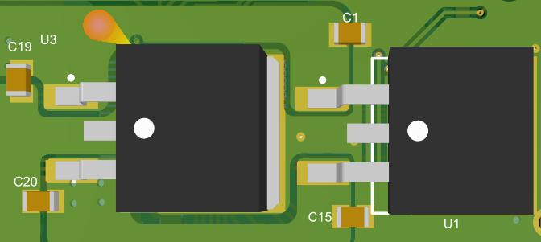

Figure 37 – 3D View of 5V Linear Power Supply

Figure 38 – 5V Linear Power Supply

It is located on the bottom layer. When placing components on the PCB, we should always position components that are connected to each other as close as possible to avoid creating unnecessary traces.

### 3.3V Power Supply Layout

Figure 39 – 3D View of 3.3V Power Supply

Figure 40 – 3.3V Linear Power Supply

Ideally, we use the bottom layer to route an extensive GND plane, but in this case, it wasn’t possible due to the large number of components and the limited space on the board.

Figure 41 – 3D View of the Bottom Layer

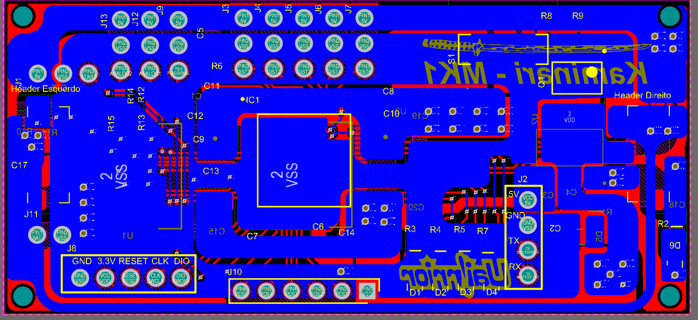

Figure 42 – Bottom Layer

In this case, we can see that the bottom layer was basically dedicated to the power supply section, and we prioritized the GND plane as much as possible.

## Auxiliary Boards Layout

### Infrared Sensors Layout

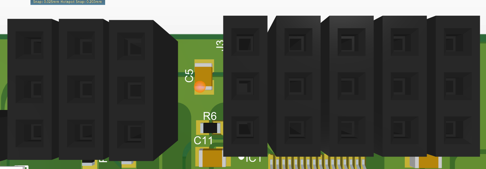

Figure 43 – 3D View of Infrared Sensors

The five headers circled in red are the digital infrared sensors, and the two circled in blue are the analog sensors. It is very important that all the sensors are placed on the same side and as close together as possible to keep the board organized.

Figure 44 – Sensor Traces

### Microstarter Layout

Figure 45 – 3D Microstarter

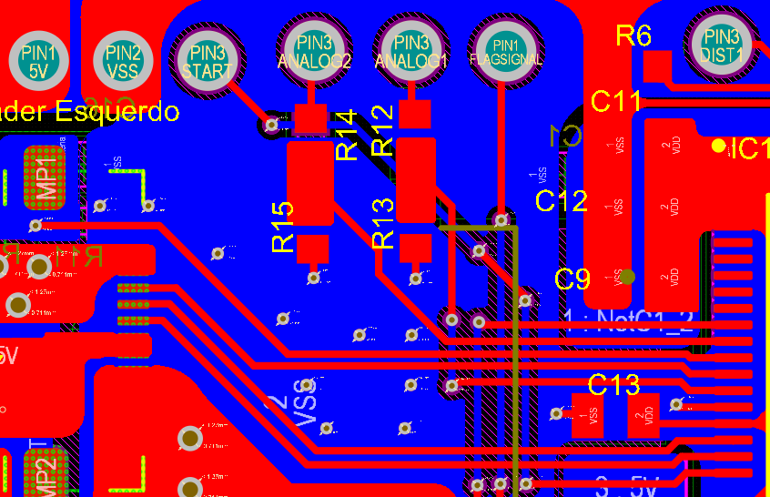

Figure 46 – Microstarter Traces

### Flag Servo Layout

Figure 47 – 3D Flag Servo

Figure 48 – Flag Servo Traces

### STM Loader Layout

Figure 49 – 3D STM Loader

Figure 50 – STM Loader Traces

Keep in mind that an STLink programmer will need to be connected to the USB port of your computer. Therefore, place it in an easily accessible corner of the board.

### Strategy Switch Layout

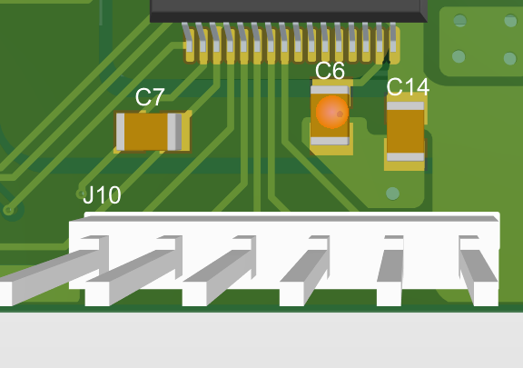

Figure 51 – 3D Control Board Switches

Figure 52 – Control Board Switches Traces

Remember to place these away from connectors for easier use, as you will need to connect the switch board if you want to use it.

Figure 53 – Strategy Switch Board

Figure 54 – Strategy Switch Board Traces

One of the headers will be replaced by a female header for connection.

### Debug LEDs and Bluetooth Layout

Figure 55 – 3D Debug LEDs and Bluetooth

Ideally, the Bluetooth module should not be placed too close to the debug LEDs to facilitate LED visibility; however, due to space limitations, this positioning was necessary.

### Control Board Layout Summary

Figure 56 – 3D Control Board Top Layer

Figure 57 – Control Board Bottom Layer

Figure 58 – Control Board Traces and Planes

It is a very compact board where organization is extremely important for easier maintenance. It was not possible to use a single layer solely for the GND plane. One layer was dedicated to the 5V and 3.3V power supplies, but it was balanced well with the GND plane.

Always prioritize GND and power planes (especially GND) to have a well-defined reference, making the board more stable and dissipating heat better. Signal traces should be as short as possible, avoiding vias whenever possible, since vias can take space away from solid GND or power planes.

## Driver Layouts

> We should prioritize the VCC and GND planes and pay attention to the side where the flat cable connector is located, avoiding placing components in its path.

> Example: If you are designing the left driver, place the connector on the right side to make it easier to connect the flat cable and gain more space on the board.

### DRV8871 Driver Layout

Figure 59 – 3D Left DRV8871

Figure 60 – 3D Right DRV8871

Figure 61 – 3D Left DRV8871

Figure 62 – 3D Right DRV8871

###  L9958SBTR Layout 

Figure 63 – 3D Left L9958SBTR

Figure 64 – 3D Right L9958SBTR

Figure 65 – 3D Left L9958SBTR

Figure 66 – 3D Right L9958SBTR

# Conclusion

A very satisfactory result was achieved: a compact and highly flexible board. It solved the problem of the previous board (Raijin), which was too large for mini sumos, and brought some improvements such as the battery meter.

However, the team still faces some difficulties soldering the connectors used to connect the drivers to the control board via flat cables, so researching alternative connection methods between the drivers and the control board would be beneficial.
