# Kaminari  
Universidade Federal de Itajubá – UNIFEI

### Build Report – Kaminari

Eric Makiya Lazanha

Itajubá

2023

## Resumo

A Kaminari é um reprojeto das placas destinadas ao mini-sumo, mudando do
Arduino para STM (STM32F405RGT). Foi criada devido a necessidade de
placas mais compactas para a categoria. Além de ser mais compacta é uma
placa muito flexível por ser uma placa de controle separada dos drivers,
sendo que a placa de controle e os drivers são conectados por cabos
*flat*. Assim, é possível usar diferentes modelos de drivers e
reprojetar apenas a placa de controle ou somente o driver.

A placa também é capaz de suportar baterias 4S (16.8V), diferente da
placa de potência TB6612FNGC8EL utilizada anteriormente.

O design da placa foi inspirado no PSVita que composto por 3 placas, uma
principal e outras duas secundárias dispostas horizontalmente com cabos.

Figura 1 PSVita desmontado

[1. Esquemático [4]](#esquemático)

[1.1 Placa de controle [4]](#placa-de-controle)

[1.1.1 Regulador 5V [4]](#regulador-5v)

[1.1.2 Regulador 3.3V [5]](#regulador-33v)

[1.1.3 Circuito Lógico [5]](#circuito-lógico)

[1.1.4 Periféricos [6]](#periféricos)

[1.1.5 Bluetooth [8]](#bluetooth)

[*1.1.6* *Microstarter* [9]](#microstarter)

[*1.1.7* *Switch estratégias*
[10]](#switch-estratégias)

[1.1.8 Alimentação secundária
[12]](#alimentação-secundária)

[1.1.9 Medidor de bateria
[12]](#medidor-de-bateria)

[1.1.10 LED debug [15]](#led-debug)

[1.1.11 Sensor Infravermelho
[15]](#sensor-infravermelho)

[1.1.12 Flag [17]](#flag)

[1.1.13 Conector driver [17]](#conector-driver)

[1.1.14 Driver [18]](#driver)

[1.1.15 DRV8871 esquerdo [19]](#drv8871-esquerdo)

[1.1.16 L9958SBTR [21]](#l9958sbtr)

[*2.* *Layouts* [22]](#layouts)

[2.1 *Layout* controle [23]](#layout-controle)

[2.1.1 *Layout* fonte 5V com *switch*
[23]](#layout-fonte-5v-com-switch)

[2.1.2 *Layout* fonte 3.3V [25]](#layout-fonte-33v)

[2.2 *Layout* Placas de apoio
[27]](#layout-placas-de-apoio)

[2.2.1 *Layout* Sensores infravermelhos
[27]](#layout-sensores-infravermelhos)

[2.2.2 *Layout* *microstarter*
[28]](#layout-microstarter)

[2.2.3 Layoult servo *flag*
[29]](#layoult-servo-flag)

[*2.2.4* *Layout STM loader*
[30]](#layout-stm-loader)

[2.2.5 *Layout switch* estratégias
[31]](#layout-switch-estratégias)

[2.2.6 *Layout* de Leds de debug e *bluetooth*
[33]](#layout-de-leds-de-debug-e-bluetooth)

[2.2.7 Conclusão do *layout* de controle
[34]](#conclusão-do-layout-de-controle)

[2.3 *Layout* Drivers [36]](#layout-drivers)

[2.3.1 *Layout* driver DRV8871
[36]](#layout-driver-drv8871)

[2.3.2 Layoult L9958SBTR [37]](#layoult-l9958sbtr)

[3. Conclusão [38]](#conclusão)

# Esquemático

## Placa de controle

### Regulador 5V 

Para fazer uma queda de tensão de 12,6V (tensão da bateria 3S) para 5V
foi utilizada uma fonte linear com 2 reguladores de tensão
(L7805CD2T-TR) em paralelo para garantir de não ter problemas com a
dissipação de calor.

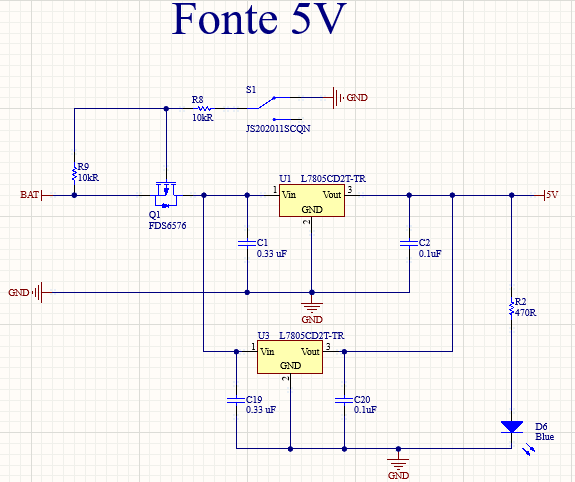

Figura 2 Fonte linear 5V

Além dos reguladores tensão também temos o conjunto do *switch*
(JS202011SCQN) com o mosfet (FDS6576) para desligar a placa sem ser
necessário desconectar a bateria, o mosfet também funciona como uma
proteção contra inversão de polaridade, também é utilizado um Led de
debug.

### Regulador 3.3V 

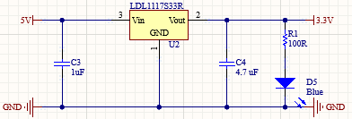

Figura 3 Fonte linear 3.3V

Para redução de 5V para 3.3V foi utilizada uma fonte linear com o
regulador de tensão (LDL1117S33R), foi inspirado no regulador de 3.3V da
Raijin que já foi validado.

### Circuito Lógico

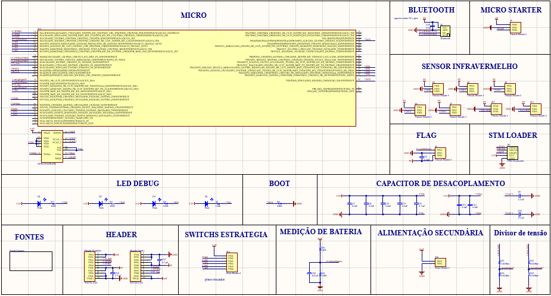

Figura 4 Esquemático micro

A escolha desse micro foi crucial para o desenvolvimento geral dos
autônomos, onde nossa categoria, a do seguidor de linha (*follow line*)
escolheu o mesmo micro, porém com o encapsulamento de 64 pinos, o que
gera uma maior compatibilidade dos códigos e que facilitam a
contribuição de ambas as categorias nos desenvolvimentos delas, além da
necessidade dos seguidores de utilizar mais componentes que o mini sumo.

O micro da ST foi uma decisão tomada em conjunto com os integrantes do
*follow line* com o intuito de ter uma maior interação na categoria dos
autônomos afim de deixar fatores comuns dos robôs como motores e
sensores padronizados. Assim, contribuindo para uma evolução mútua das
categorias.

Para a programação deste micro é utilizado um barramento de *headers*
que, por sua vez vão conectados a um STlink que nos permite a conexão
dele a porta USB dos computadores

Figura 5 STM bootloader 

Figura 6 STlink

### Periféricos 

Agora por fim dos esquemáticos passamos as placas que ajudam as decisões
que o robô necessita tomar.

Para barramentos de 3 pinos uma forma de proteção que adotamos e
recomendamos fortemente para todos os projetos é colocar pino do meio
como GND.

Figura 7 Antes de aderir forma de proteção

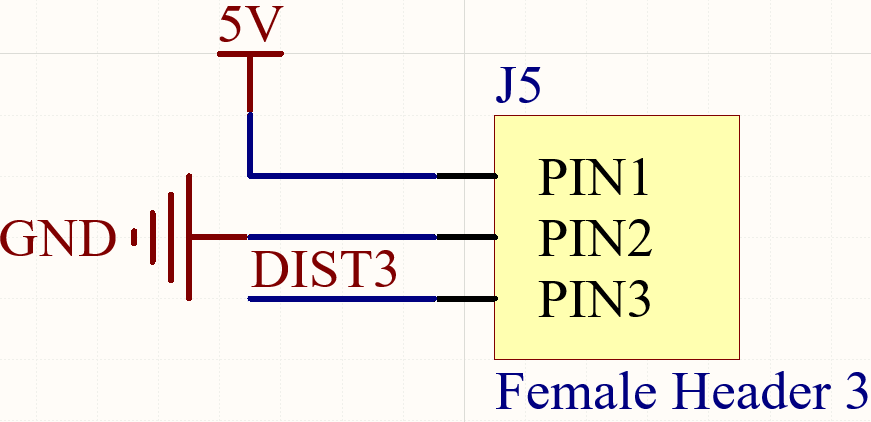

Figura 8 Depois de aderir forma de proteção

Por que fazer essa alteração?

Imagine que você está em um pré-guerra faltando uma semana para a
competição, tentando conciliar a vida de universitário da UNIFEI e a
vida de um membro da equipe UAI!RRIOR, em um momento de cansaço e você
poderia acabar fechando um curto GND VCC com o modelo antigo, queimando
seus componentes e tendo que soldar outra placa (em um cenário bom onde
tem componentes reserva). No entanto, se você colocar o GND no meio você
apenas vai trocar o pino do sinal com o VCC, dessa forma sua única
preocupação vai ser trocar os dois de lugar.

Além disso, é de suma importância posicionar os capacitores de
desacoplamento e o resistor de *boot* próximos aos seus pinos, com o
intuito de evitar perdas como ocorreu em projetos passados.

Figura 9 Resistor de boot e capacitores de desacoplamento

### Bluetooth

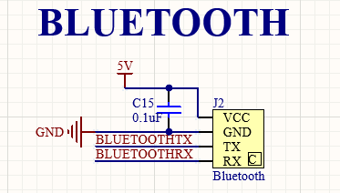

Figura 10 Bluetooth

Facilitar e profissionalizar as escolhas e ajustes das estratégias por
meio de um aplicativo, também foi implementado no *follow line*, para
não ser necessário o uso dos computadores ao levar os sumos para
temporização e o *follow line* para ajustes na pista.

### *Microstarter*

Figura 11 Micro starter

O *microstarter* é uma placa comprada e sua função é receber o sinal um
infravermelho e decodificá-lo, enviando essa informação para o micro.
Portanto, seu objetivo é receber o sinal enviado pelo controle do juiz
para tomar uma decisão podendo ser inicializar, parar ou paridade (serve
para verificar se o robô realmente está recebendo um sinal).

###  *Switch estratégias*

Figura 12 Switches de estratégias

Caso tenha algum problema com *bluetooth* pode ser utilizado *switches*
de estratégias para escolher a estratégia manualmente por meio de uma
placa separada que se encaixa na placa de controle (circulada de
vermelho na imagem a seguir).

Figura 13 Switch estratégia na placa de controle

Essa placa tem a capacidade de escolher até 32 estratégias por meio de 5
*switches* que funcionam por meio do conceito de números binários. Onde
a posição do *switch* define se ele representa 0 ou 1.

Figura 14 Placa dos switches

Figura 15 Decimal para binário

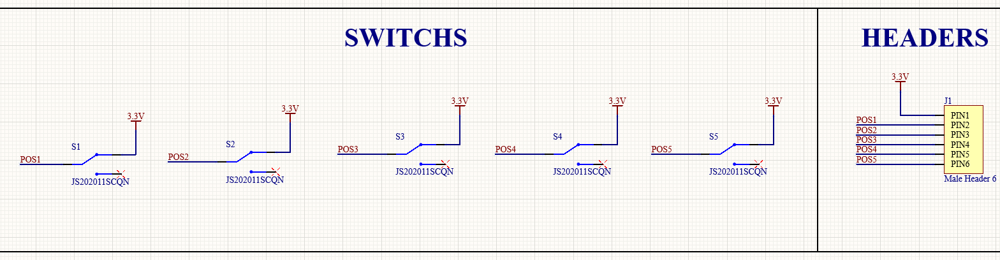

Figura 16 Esquemático switches de estratégias

Uma placa bem simples que poderá ser conectada por *headers* com a placa
de controle.

### Alimentação secundária

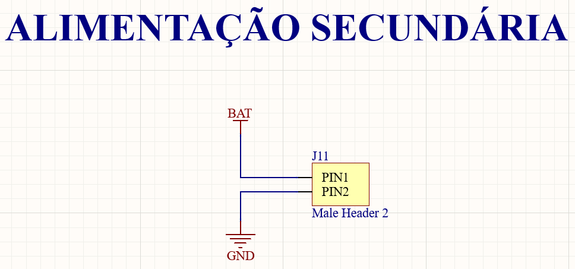

Figura 17 Alimentação secundária

Utilizada para alimentar diretamente a placa de controle, sem
necessidade de acoplar os drivers. A não precisa ser alimentado com 5V,
pois ainda passará pelos reguladores de tensão.

### Medidor de bateria

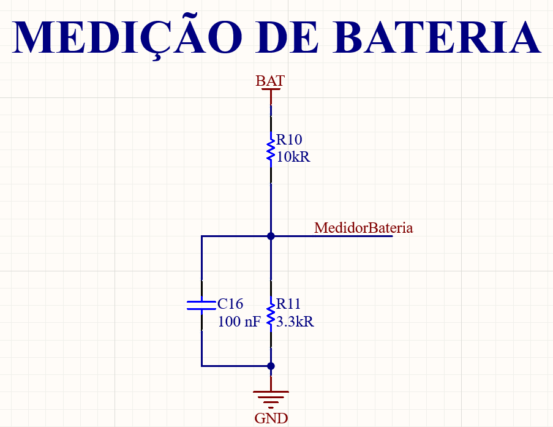

Figura 18 Medidor de bateria

É utilizado um divisor de tensão para medir a tensão na bateria que vai
para uma entrada ADC.

Exemplo para uma bateria 3S (12.6V):

- A corrente vai ser 12,6 /13k3 = 0,95mA.

- A tensão no resistor q vai para o micro vai ser 3k3\*0,95m = 3,13 V.

- Com a tensão da bateria em 11,4 por exemplo temos 11,4/13k3 = 0,86mA.

- A tensão no resistor ia ser 3k3\*0,86m = 2,84 V.

Podemos usar 3.13V como 255 e 0V como 0 através da programação. Assim,

a partir de um certo ponto pode-se programar os LED´s para sinalizar de
alguma forma que a bateria deve ser trocada.

Vale ressaltar que a entrada ADC (*Analog-to-digital converter*)
suportam apenas 3.3V na entrada de alimentação conforme o *datasheet*,
por isso foi necessário diminuir a tensão. O capacitor só serve para
manter o sinal estável (capacitor de desacoplamento).

Figura 19 Datasheet tensão máxima na entrada do micro

Também é possível utilizar uma bateria 4S (16.8V), porém é necessário
trocar o resistor de 3k3 ohms para 2k2 ohms para tensão de entrada no
micro ser menor que 3.3V. E seria preciso alterar o cálculo da bateria
na programação também.

### LED debug

Figura 20 LED debug

Para facilitar a utilização e de codagem foram colocados 4 LED´s de
debug, que ajuda aquele que estiver programando para solucionar
possíveis erros de código.

### Sensor Infravermelho

Figura 21 Sensores infravermelho

Possui disponibilidade para 7 sensores, sendo 5 digitais e 2 analógicos.
É de extrema importância que os sensores JS40F e EM3 sejam alimentados
por 5V para sensor ler com a capacidade total da distância que é
informada pelo fabricante.

Foi necessário fazer um divisor de tensão diminuindo a alimentação nas
entradas ADC (*Analog-to-digital converter*) de 5V para 3.3V, pois a
entrada ADC do micro aguenta no máximo 3.3V, da mesma maneira que foi
comentada no medidor de bateria. Porém, a alimentação não vem
diretamente da bateria, ela passa pelo regulador de tensão que regula
para 5V.

Figura 22 Divisor de tensão sensor analógico

### Flag

Figura 23 Servo para flag

Servo é específico para robôs que usam *flag*, que tem como objetivo
“enganar” o sensor do adversário.

### Conector driver

Figura 24 Esquemático driver

Houve uma troca dos *headers* que eram usados em projetos anteriores
para os conectores devido a mau contato e eles saiam frequentemente.

É importante ter muito cuidado na hora de projetar os esquemáticos dos
drivers, o lado direito deve ser feito invertido para encaixar
corretamente na placa, dessa forma o projeto dos drivers se torna um
projeto de certa forma separado, possibilitando a projeção de diversos
drivers e juntar com a placa de controle por meio de dois conectores
(505278-1033) e dois cabos *flat*. Posicionados conforme ilustrado na
imagem a seguir:

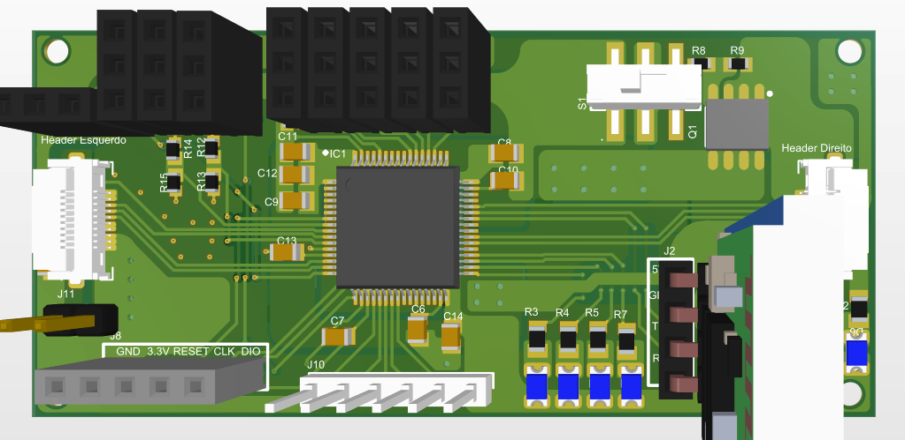

Figura 25 Conector cabo flat

### Driver

Foram projetados 2 modelos de drivers diferentes (DRV8871 e L9958SBTR)
para serem utilizados nessa placa, essa escolha foi feita para caso
houvesse algum problema com um dos drivers ainda seria possível validar
a placa caso o problema não seja a placa de controle. Ademais, isso
permite uma grande flexibilidade nas escolhas da equipe.

### 

### DRV8871 esquerdo

Figura 26 Esquemático DRV8871

Esse foi um driver recomendado pela Trincabotz e já tinha
disponibilidade na salinha devido ao seu uso no *follow line.* Vale
ressaltar que os esquemáticos são iguais, mudando apenas a parte de
controle.

O driver funcionou conforme o esperado.

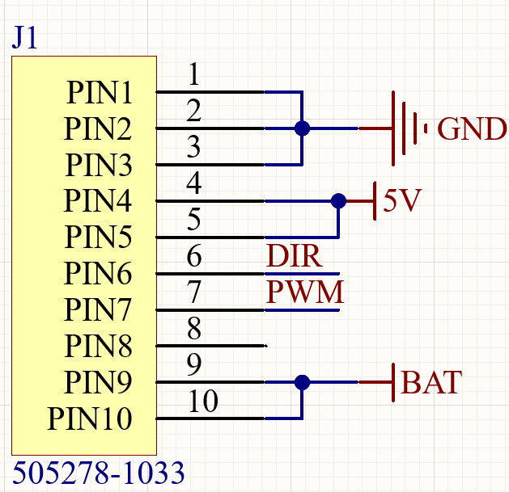

Figura 27 Conector DRV8871 esquerdo 

Figura 28 Conector DRV8871 direito

Os conectores estão espelhados conforme o encaixe na placa de controle.

### L9958SBTR

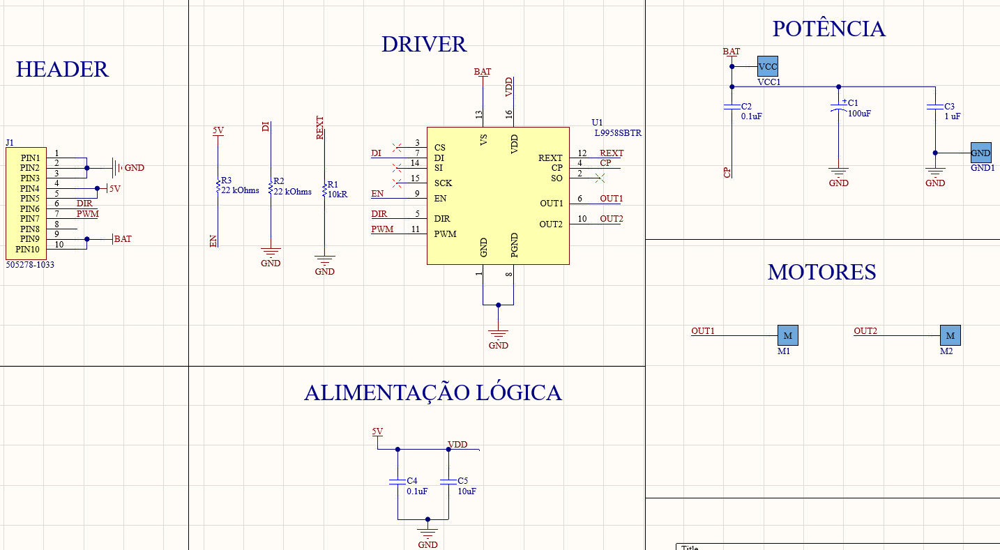

Figura 29 Esquemático L9958SBTR

Esse driver foi escolhido por já ter sido utilizado em outros projetos
da equipe, além de estar disponível na salinha.

No primeiro momento a placa não funcionou corretamente, então fechamos
curtos nos resistores circulado abaixo e funcionou perfeitamente. Porém,
esse mau funcionamento pode ter sido um problema de programação

Figura 30 3D L9958SBTR direito 

Figura 31 3D L9958SBTR esquerdo

Figura 34 Exemplo PCB da Kaminari

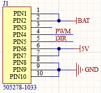

Figura 33 Conector L9958SBTR direito

> Os conectores estão espelhados conforme o encaixe na placa de
> controle.

# *Layouts*

O *Layou*t de uma PCB, nada mais é que sua forma final de como irá ficar
traçado suas conexões e posicionamento dos componentes, além da
definição de seu tamanho.

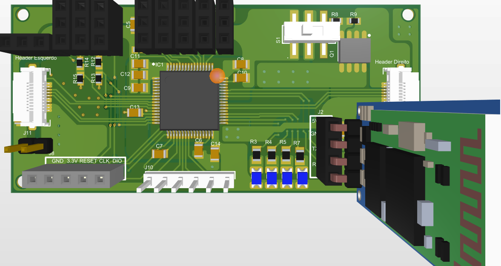

Figura 35 Exemplo PCB da Kaminari

## *Layout* controle

### *Layout* fonte 5V com *switch*

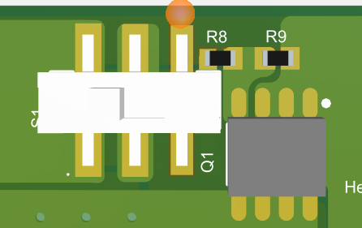

Figura 35 3D switch fonte 5V linear

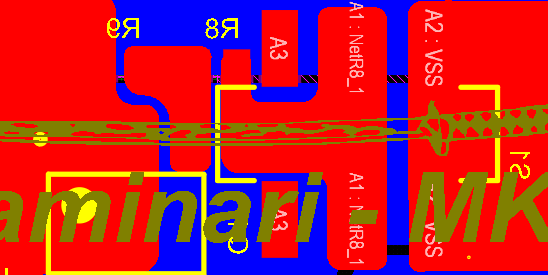

Figura 36 Switch fonte 5V linear

O *switch* deve ficar na *top layer* para ser acessível para ligar e
desligar a placa facilmente.

### *Layout* fonte 5V

Figura 37 3D fonte 5V linear

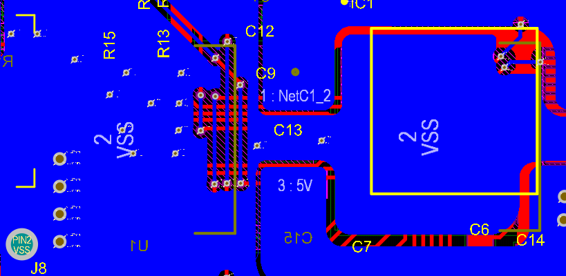

Figura 38 Fonte linear 5V

É encontrada na *bottom layer*, quando posicionamos componentes na PCB
sempre devemos colocar os componentes que são ligados entre si o mais
próximo possível para evitar fazer muitas trilhas desnecessárias.

### *Layout* fonte 3.3V

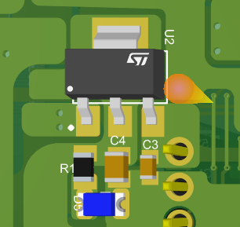

Figura 39 3D fonte 3.3V

Figura 40 Fonte linear 3.3V

Idealmente utilizamos a *bottom layer* para passar um plano GND extenso,
porém não foi possível nesse caso devido a grande quantidade de
componentes e ao espaço limitado da placa.

Figura 41 3D da bottom layer

Figura 42 Bottom Layer

Nesse caso podemos ver que a *bottom layer* foi basicamente dedicada a
parte da fonte e tentamos priorizar ao máximo o plano GND.

## *Layout* Placas de apoio

### *Layout* Sensores infravermelhos

Figura 43 3D sensores infravermelhos

Os 5 *headers* circulados em vermelho são os sensores infravermelhos
digitais e os dois circulados em azul são os sensores analógicos, é
muito importante que os sensores fiquem todos do mesmo lado e o mais
próximo possível para deixar a placa mais organizada.

Figura 44 Trilhas sensores

### *Layout* *microstarter*

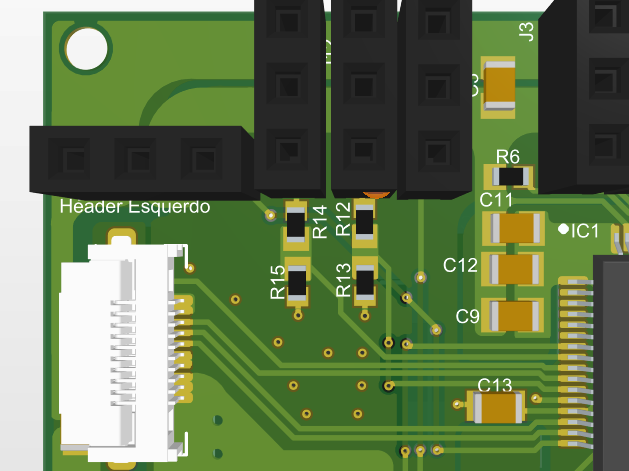

Figura 45 3D microstarter

Figura 46 Trilha microstarter

### Layoult servo *flag*

Figura 47 3D servo flag

Figura 48 Trilha servo flag

### *Layout STM loader*

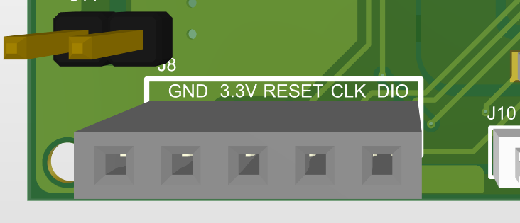

Figura 49 3D STM loader

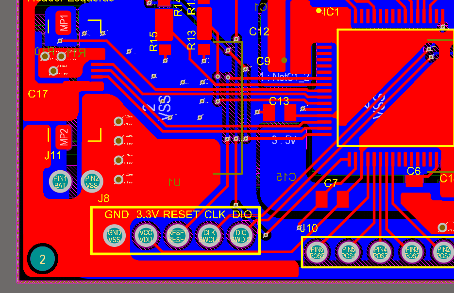

Figura 50 Trilha STM loader

Levar em consideração que será preciso inserir um *STlink* que será
conectado na entrada USB do seu computador. Então, deixá-lo em um canto
da placa de fácil acesso.

### *Layout switch* estratégias 

Figura 51 3D switches placa de controle

Figura 52 Trilha switches placa de controle

Lembrar de deixar longe dos conectores para facilitar o uso, pois se for
necessário utilizar será preciso encaixar a placa com os *switches.*

Figura 53 Placa de switches de estratégias

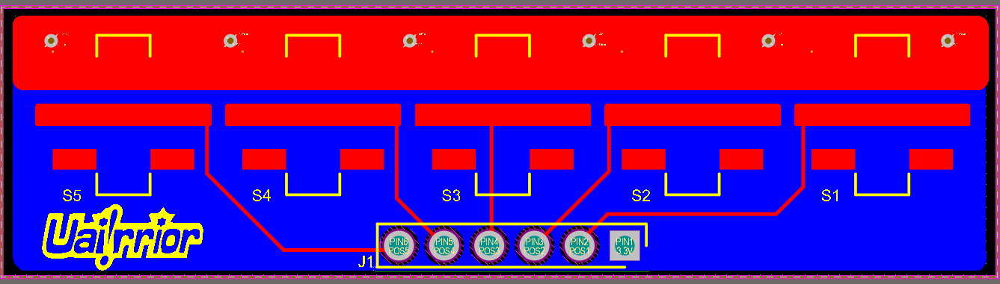

Figura 54 Trilha placa de switches de estratégias

Um dos *headers* será substituído por um header fêmea para o encaixe.

### *Layout* de Leds de debug e *bluetooth*

Figura 55 3D Leds debug e bluetooth

O ideal seria o módulo *bluetooth* não ficar muito perto dos leds de
debug para facilitar a visualização dos LED´s, porém devido a limitação
de espaço foi necessário esse posicionamento.

### Conclusão do *layout* de controle

Figura 56 3D placa de controle top layer

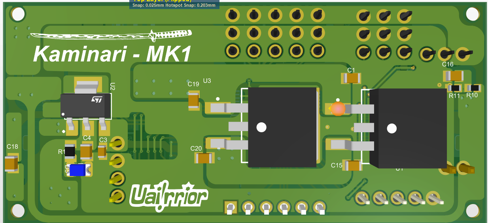

Figura 57 Placa de controle bottom layer

Figura 58 Trilhas e planos da placa de controle

É uma placa bem compacta onde organização é extremamente importante para
facilitar manutenção, não foi possível usar uma *layer* só para o plano
GND. Foi utilizada uma *layer* só para a fonte de 5V e 3.3V, mas deu
para conciliar bem com o plano GND.

Sempre priorizar os planos GND e de alimentação (principalmente GND),
para ter um referencial bem presente tornando a placa mais estável e
dissipando melhor o calor. As trilhas de sinais devem ser o mais curtas
possíveis e evitando ao máximo o uso de vias para trilhas, devido ao
fato de ocupar o espaço de um possível plano sólido GND ou alimentação.

## *Layout* Drivers

> Devemos priorizar o plano VCC e GND e é importante se atentar no lado
> em que o cabo flat está saindo e não colocar componentes em seu
> caminho.
>
> Exemplo: caso esteja projetando o driver esquerdo coloque o conector
> no canto direito para ficar mais fácil de conectar o cabo flat e
> ganhar mais espaço na placa.

### *Layout* driver DRV8871

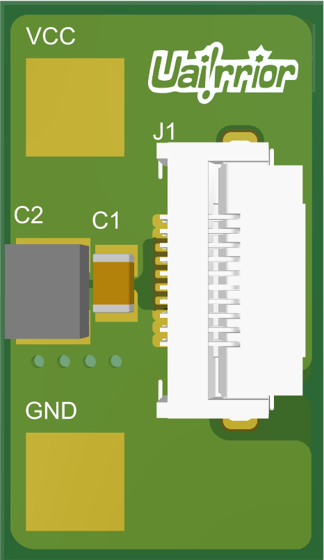

Figura 59 3D DRV8871 esquerdo Figura 

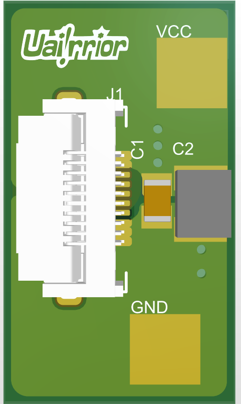

60 3D DRV8871 direito

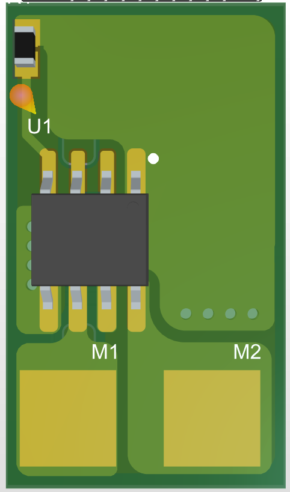

Figura 61 3D DRV8871 esquerdo 

Figura 62 3D DRV8871 direito

###  Layoult L9958SBTR 

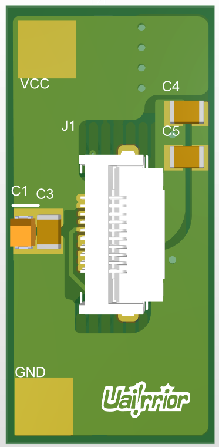

Figura 63 3D L9958SBTR esquerdo Figura

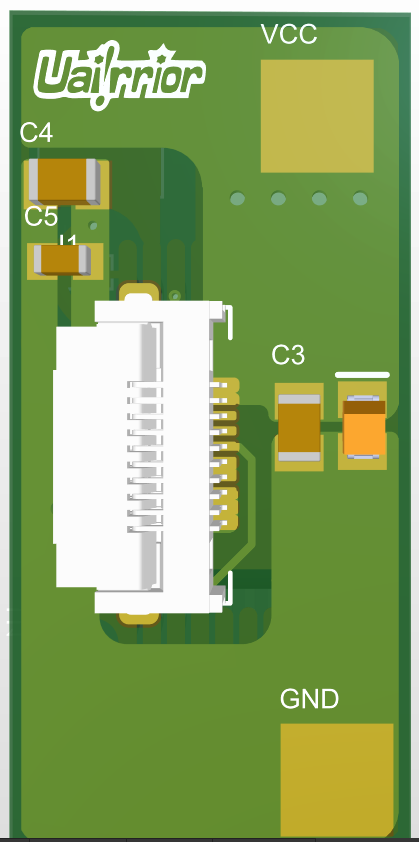

 64 3D L9958SBTR direito

Figura 653D L9958SBTR esquerdo   

Figura 66 3D L9958SBTR direito

# Conclusão

Obteve um resultado muito satisfatório, uma placa compacta e
extremamente flexível. Resolveu o problema da placa anterior (Raijin)
que era uma placa muito grande para os mini sumos e trouxe algumas
melhorias como o medidor de bateria.

Porém a equipe ainda possui algumas dificuldades para soldar os
conectores que são utilizados para fazer a conexão dos drivers com a
placa de controle por meio de cabos flat, sendo interessante a pesquisa
de outros meios para fazer a conexão entre os drivers e a placa de
controle.
